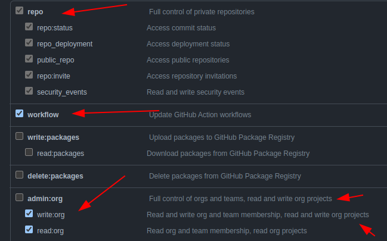

# Ansible Valida Role
Use esta actions para adicionar automaticamente as issues a um projeto do GitHub. Observe que isso é para projetos do GitHub (beta), não para os projetos originais do GitHub.

## Criar usuário e token
Os tokens de acesso pessoal (PATs) é uma forma de concedendo permissão de acesso para API do GitHub e linha de comando.

> Para saber mais acesse: [Token de acesso GitHub](https://docs.github.com/pt/authentication/keeping-your-account-and-data-secure/creating-a-personal-access-token)

Para esse projeto é necessário criar um token com as seguintes permissões de acesso: 


  

## Inputs
| Nome | Descrição | Requirida |Default |
|------|-----------|-----------|--------|
|`project_url` | URL do projeto beta do Github | sim | n/d |
|`github_token` | Personal token para leitura/escrita no projeto Github | sim | s/n |

## Utilizando 
Criar a seguintes estrutura de diretórios: 

`.github/workflows/<proposito>.yml`

Utilize o exemplo abaixo para seu pipeline de CI:

```yaml
name: "Adiciona Issues em Projects GitHub"
  
on:
  issues:
    types:
      - opened
jobs:
  add-issue:
    uses: "mentoriaiac/cicd_centralizado/.github/workflows/add_issues_projects.yaml@v1"
    with:
      project_url: https://github.com/orgs/mentoriaiac/projects/6
    secrets:  
      token: ${{ secrets.ADD_TO_PROJECT_PAT }}
```
